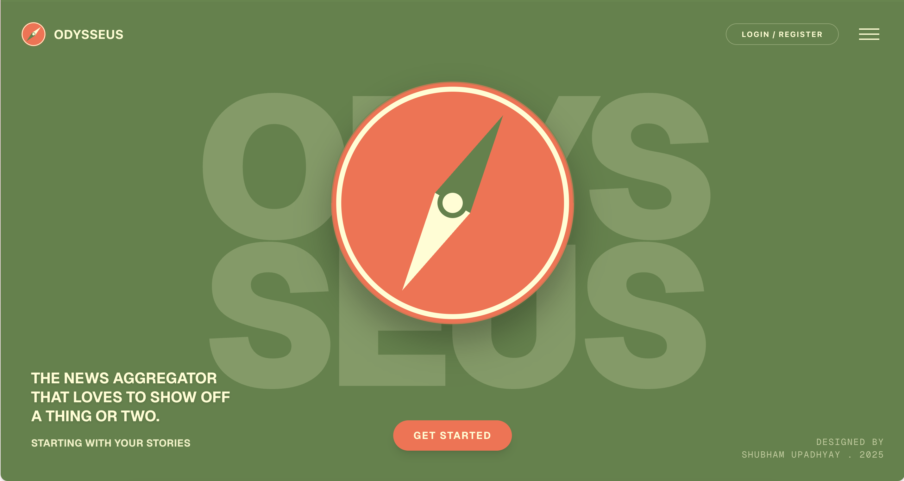
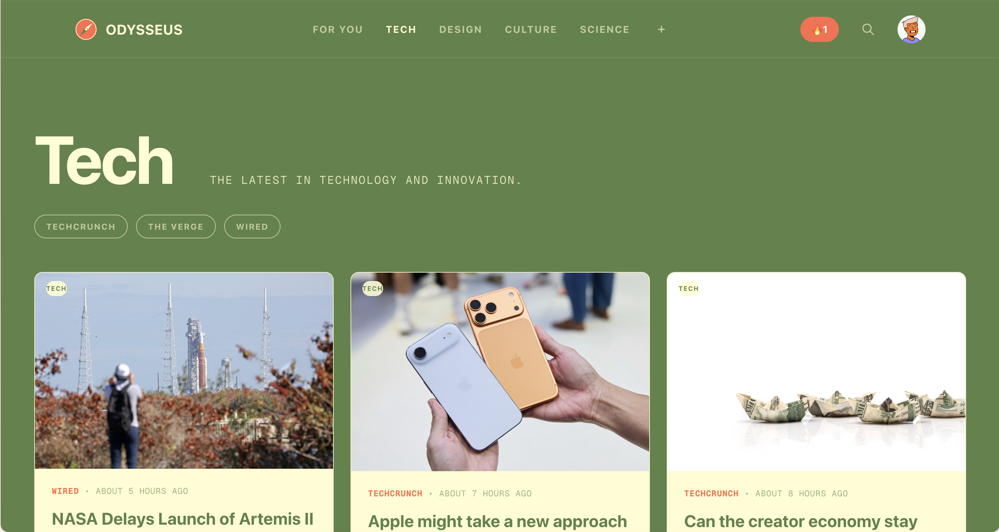
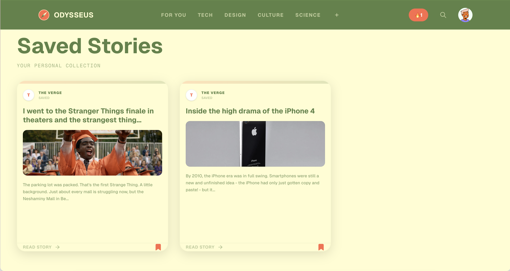
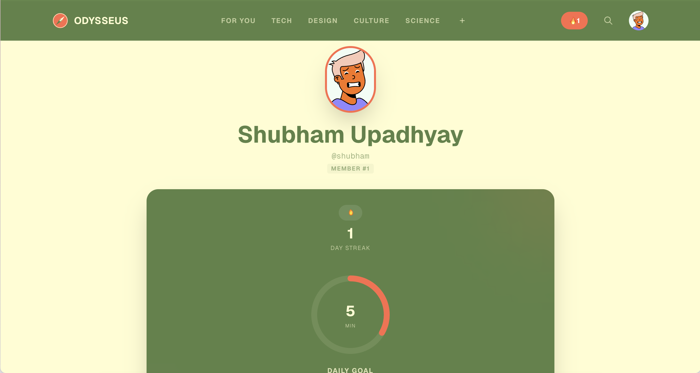

# Odysseus

<div align="center">
  <h1 align="center">Odysseus</h1>
  <p align="center">
    <strong>A modern, full-stack RSS reader built for focus and curiosity.</strong>
  </p>

  <p align="center">
    
    
    
    
    
    
  </p>

  <p align="center">
    <a href="#features">Features</a> •
    <a href="#tech-stack">Tech Stack</a> •
    <a href="#getting-started">Getting Started</a> •
    <a href="#deployment">Deployment</a>
  </p>
</div>

---

## 📖 Overview

**Odysseus** is a modern, full-stack RSS reader designed to provide a streamlined reading workflow. It aggregates RSS feeds, extracts readable article content, and presents it in a minimal interface optimized for focus.

The application features a robust reading interface, feed subscription management, and a chronological archive of saved stories, all wrapped in a cohesive visual identity.

## ✨ Features

- **Distraction-Free Reading**: A clean, focused reader interface for articles.
- **Feed Aggregation**: Automatically fetch and parse RSS entries from your favorite sources.
- **Readability Mode**: Extract full article content using Mozilla Readability.
- **Save for Later**: Bookmark articles for future reading.
- **Data Analysis**: Visual analytics for reading habits, including:
  - Current Streaks
  - Daily Goal Tracking
- **Authentication**: Secure user accounts powered by Supabase Auth.
- **Responsive Design**: Fully optimized for desktop and mobile reading experiences.

## 📸 Functionality & Usage

### The Landing Page


<p align="center"><em>A welcoming interface that introduces the news aggregator.</em></p>

### For You Feed


<p align="center"><em>A personalized feed greeting you and ready for exploration.</em></p>

### The Collection


<p align="center"><em>Curated stories from your favorite sources, organized for your curiosity.</em></p>

### Category View


<p align="center"><em>Browse stories by category, such as the latest in technology and innovation.</em></p>

### Top Story


<p align="center"><em>A dedicated view for top stories, highlighting important news.</em></p>

### Reader View


<p align="center"><em>A distraction-free reading experience for full articles.</em></p>

### Saved Stories


<p align="center"><em>Your personal collection of bookmarked articles.</em></p>

### Profile & Stats


<p align="center"><em>Track your reading streaks and daily goals.</em></p>

---

## 🛠 Tech Stack

This project is built using the latest features of the React ecosystem, focusing on performance and type safety.

- **Framework**: [Next.js 16](https://nextjs.org/) (App Router)
- **Language**: [TypeScript](https://www.typescriptlang.org/)
- **Styling**: [Tailwind CSS](https://tailwindcss.com/) with custom configuration
- **Database & Auth**: [Supabase](https://supabase.com/) (PostgreSQL)
- **Animations**: [Framer Motion](https://www.framer.com/motion/)
- **Content Extraction**: Mozilla Readability & DOMPurify
- **Deployment**: [Vercel](https://vercel.com/)

### Project Structure

```bash
├── public/               # Static assets & screenshots
├── src/
│   ├── app/              # Next.js App Router pages & API routes
│   ├── components/       # Reusable UI components
│   ├── hooks/            # Custom React hooks
│   └── lib/              # Utility functions & Supabase client
├── supabase/             # Database schema and migrations
└── tailwind.config.mjs   # Custom design token configuration
```

## 🚀 Getting Started

Follow these steps to set up the project locally.

### Prerequisites

- Node.js 18+ 
- npm or pnpm
- A Supabase project

### Installation

1. **Clone the repository**
   ```bash
   git clone https://github.com/yourusername/odysseus.git
   cd odysseus
   ```

2. **Install dependencies**
   ```bash
   npm install
   # or
   pnpm install
   ```

3. **Configure Environment Variables**
   Create a `.env.local` file in the root directory and add your Supabase credentials:
   ```env
   NEXT_PUBLIC_SUPABASE_URL="your-supabase-url"
   NEXT_PUBLIC_SUPABASE_ANON_KEY="your-supabase-anon-key"
   ```

4. **Initialize Database**
   Run the SQL scripts in the `supabase/` directory in your Supabase SQL editor to set up your database schema.

5. **Run Development Server**
   ```bash
   npm run dev
   ```

   Open [http://localhost:3000](http://localhost:3000) with your browser to see the result.

## 🚢 Deployment

The easiest way to deploy your Next.js app is to use the [Vercel Platform](https://vercel.com/new?utm_medium=default-template&filter=next.js&utm_source=create-next-app&utm_campaign=create-next-app-readme).

1. Push your code to a GitHub repository.
2. Import the project into Vercel.
3. Add your `NEXT_PUBLIC_SUPABASE_URL` and `NEXT_PUBLIC_SUPABASE_ANON_KEY` to the Environment Variables settings in Vercel.
4. Deploy!

## 📄 License

This project is licensed under the MIT License - see the [LICENSE](LICENSE) file for details.

---

<div align="center">
  <sub>Built with ❤️ by Shubham Upadhyay</sub>
</div>
